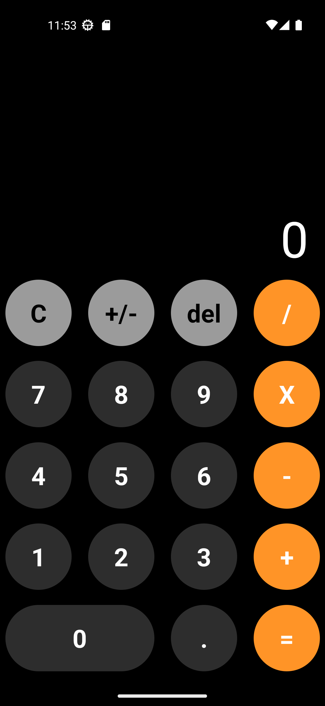
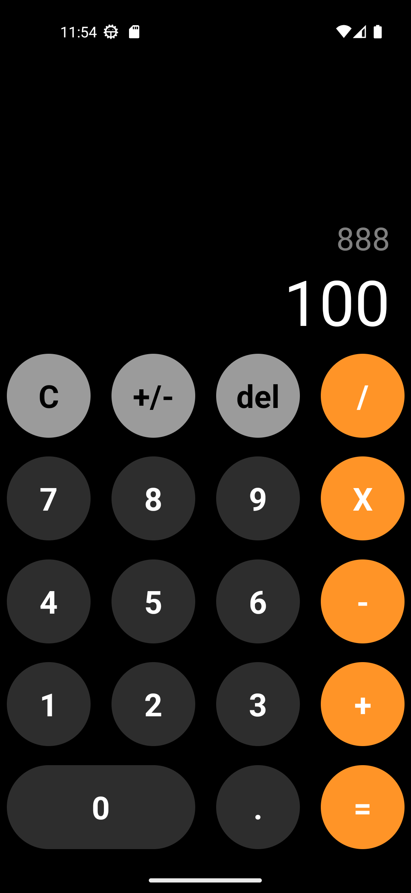

# Calculator app
Basic operations calculator built with React Native.

## Installation
1. Clone the repository
```bash
git clone https://github.com/Fernando-LRz/calculator-app.git
``` 
2. Navigate to the project directory
```bash
cd calculator-app
```
3. Install dependencies
```bash
npm install
```

## Run the app
```bash
npx react-native run-android
``` 

## App images
<div style="display: flex;">
  
  
</div>
